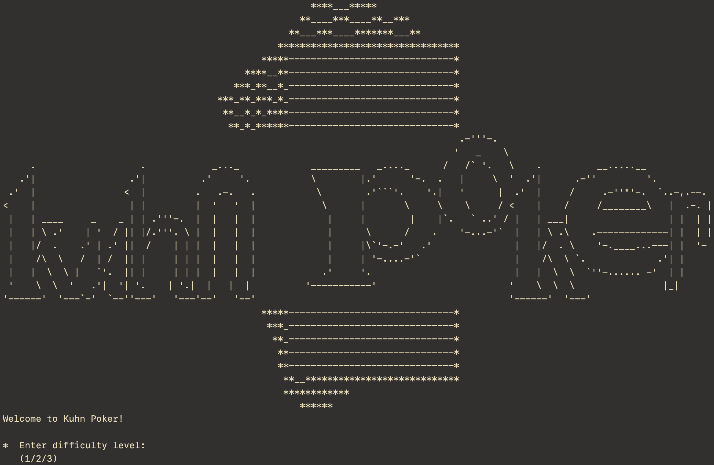

# Kuhn Poker

This project implements CFR (Counterfactual Regret Minimization) to solve [Kuhn Poker](https://en.wikipedia.org/wiki/Kuhn_poker), along with a CLI-based game to play against the algorithm:



## Requirements
- **C++ version:** C++20 or later
- **CMake version:** 3.30 or later

## Usage
First clone the repository and navigate to the root directory of the project:

```bash
git clone https://github.com/luca-miniati/kuhn-poker && cd kuhn-poker
```

### Build

To build the project, run

```bash
mkdir build && cd build && cmake .. && make
```

### Run

To run the game, build the project and run

```bash
./src/RunGame
```
To run the solver, build the project and run
```
./src/RunSolver
```

## References
[An Introduction to Counterfactual Regret Minimization](https://www.ma.imperial.ac.uk/~dturaev/neller-lanctot.pdf)

[Vanilla Counterfactual Regret Minimization for Engineers](https://justinsermeno.com/posts/cfr/)